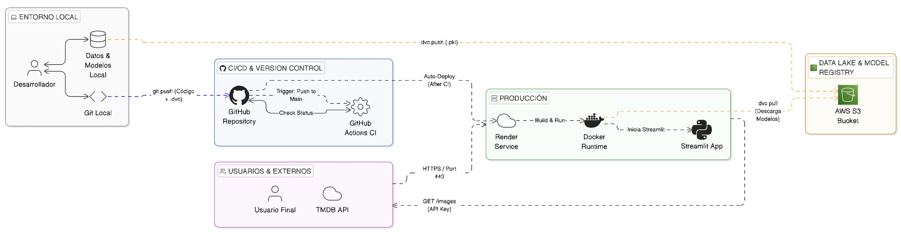

# CineWeek – Movie Recommendation System FV

CineWeek is an end-to-end movie recommendation system designed to deliver personalized movie suggestions using machine learning and modern MLOps practices. The project focuses on a **production-ready architecture**, covering the full lifecycle from data ingestion to deployment.

## Project Overview

CineWeek integrates external movie data sources with a recommendation engine and exposes results through a web application deployed in production. The system is designed with reproducibility, automation, and scalability in mind.

## Architecture & Workflow

- **Data ingestion** from external movie APIs (movie metadata, genres, popularity, ratings).
- **Cloud data storage** using **AWS S3** as a data lake and model registry.
- **Data and model versioning** with **DVC**, ensuring reproducibility across experiments.
- **Recommendation engine** based on content-based filtering and similarity metrics.
- **CI/CD pipeline** implemented with **GitHub Actions**, triggered on pushes to the main branch.
- **Containerized application** using **Docker**.
- **Production deployment** on **Render**, which builds and runs the Docker image.
- **Interactive frontend** built with **Streamlit**, served over HTTPS.

  

## Key Features

- Personalized movie recommendations.
- Reproducible ML experiments and models.
- Automated build and deployment pipeline.
- Clear separation between development and production environments.
- Cloud-based data and model management.

## Tech Stack

- 🐍 **Python** – principal Language
- 🧮 **Pandas / NumPy** – data manipulation and analysis
- 🤖 **Scikit-learn** – recommendation engine / machine learning
- ⚡ **FastAPI** – backend API framework
- 🛠️ **Uvicorn** – ASGI server for FastAPI
- 🎨 **Streamlit** – frontend
- 🐳 **Docker** – containerization
- ⚙️ **GitHub Actions (CI/CD)** – automated pipelines
- 📦 **DVC** – data and model versioning
- ☁️ **AWS S3** – storage for files dvc, data
- 🚀 **Render** – deploy

## Objective

The goal of CineWeek is to demonstrate how a real-world recommendation system can be designed, versioned, and deployed following industry-aligned MLOps practices, moving beyond a local or purely experimental setup.
